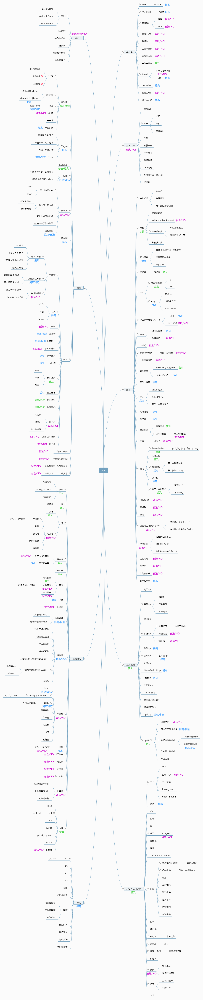
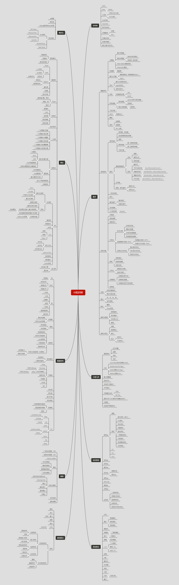
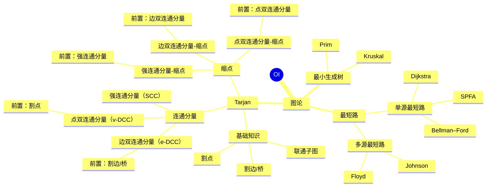
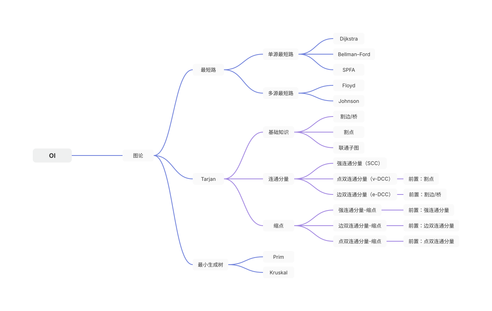

```mermaid
mindmap
  root((OI))
    图论
      最短路
        单源最短路
          Dijkstra
          Bellman–Ford
          SPFA
        多源最短路
          Floyd
          Johnson
      Tarjan
        基础知识
          割边/桥
          割点
          联通子图
        连通分量
          强连通分量（SCC）
          点双连通分量（v-DCC）
            前置：割点
          边双连通分量（e-DCC）
            前置：割边/桥
        缩点
          强连通分量-缩点
            前置：强连通分量
          边双连通分量-缩点
            前置：边双连通分量
          点双连通分量-缩点
            前置：点双连通分量
      最小生成树
        Prim
        Kruskal
```

