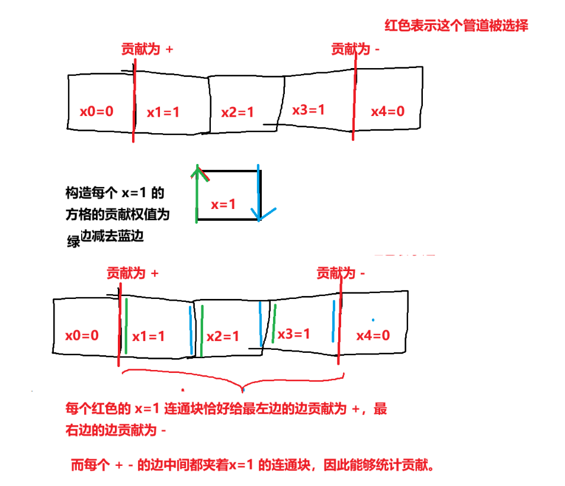

# 2026“钉耙编程”中国大学生算法设计暑期联赛（9）题解

# 1001 歪歪巧克力

### 简要题意

给定 $n$ 块巧克力，第 $i$ 块价格为 $a_i$。

歪歪会以任意顺序购买巧克力。若某块巧克力的价格大于布布当前余额的一半，布布便不会购买它；否则购买并扣除相应金额。

求布布最少需要准备多少钱，才能保证歪歪买完所有巧克力。

$\sum n \le 10^4$

### 题解

设所有巧克力的价格之和为 $S=\sum_{i=1}^{n}a_i$，最大价格为 $M=\max_{i=1}^{n}a_i$。因为是任意顺序购买，所以一种简单的构造方式是把价格最大的巧克力放在最后一个买，那么至少需要 $S+M$ 块钱。容易发现这就是答案。

* **必要性**：

> 考虑将价格最大的巧克力放在最后购买。购买它之前已经花费了 $S-M$ 元。若初始有 $x$ 元，则此时剩余 $x-(S-M)$ 元。为了能够购买价格为 $M$ 的巧克力，需要满足 $M\le \frac{x-(S-M)}{2}$，即 $x\ge S+M$。

* **充分性：**

>  假设初始准备了 $S+M$ 元。购买某块价格为 $a_i$ 的巧克力前，设已经花费了 $P$ 元。由于尚未购买的巧克力中包含它，因此 $P\le S-a_i$。因此此时布布的余额满足 $S+M-P\ge S+M-(S-a_i)=M+a_i\ge 2a_i$。所以 $a_i$ 不会超过当前余额的一半，无论按照什么顺序，都能成功购买所有巧克力。

因此答案为 $\boxed{S+M}$。扫描求和和求最大值即可，时间复杂度 $O(n)$，空间复杂度 $O(1)$，注意需要使用 `long long`。

# 1002 小笨蛋

### 简要题意

小笨蛋在数轴 \([0,n]\) 上移动，从 \(0\) 出发并最终回到 \(0\)。

每次可以执行：

- `L`：向左移动一格；
- `R`：向右移动一格。

在 \(0\) 执行 `L`、在 \(n\) 执行 `R` 时，位置不变。

给定数组 \(c_0,c_1,\ldots,c_n\)，其中 \(c_i\) 表示移动后到达位置 \(i\) 的次数，初始位于 \(0\) 的这一次不计入。

有 \(q\) 次操作，每次将区间 \([L,R]\) 内的所有 \(c_i\) 加上 \(\Delta\)，然后判断当前数组能否由某个合法移动序列产生。如果可以且 \(\mathrm{opt}=1\)，还要输出字典序最小的移动序列。

$\sum n,q\le 2\times 10^5,c_n>0$

### 题解

因为始终有 \(c_n>0\)，所以合法路径一定到达过 \(n\)。题目又要求从 \(0\) 出发并最终回到 \(0\)，因此一定包含一次 $0\to1\to\cdots\to n\to\cdots\to1\to0$ 的基础过程，其中端点 \(0,n\) 各被到达一次，让每个中间点被到达两次。因此我们先扣除这些必然产生的贡献：

* $b_0=c_0-1,b_n=c_n-1,$
* $b_i=c_i-2\ (1\le i<n).$

剩余操作只包含边界处的原地停留，以及在相邻位置之间进行额外往返。

#### 合法性判断

设 \(x_i\) 表示第 \(i\) 条边额外往返的次数，其中：

- \(x_0\) 表示在 \(0\) 处向左原地停留的次数；
- \(x_{n+1}\) 表示在 \(n\) 处向右原地停留的次数；
- \(x_i\ (1\le i\le n)\) 表示在 \(i-1\) 与 \(i\) 之间额外往返的次数。

于是有 $b_i=x_i+x_{i+1}\ (0\le i\le n)$。令 \(x=x_0\)，则可以依次递推：$x_{i+1}=b_i-x_i$。

定义交错前缀和：$P_i=b_0-b_1+b_2-\cdots+(-1)^i b_i$，那么由递推式可以得到 $x_{i+1}=(-1)^i(P_i-x).$

因为所有 \(x_i\) 都必须非负，所以：

- 当 \(i\) 为偶数时，$P_i\ge x;$
- 当 \(i\) 为奇数时，$P_i\le x;$
- 同时 \(x\ge0\)。

因此存在合法方案，当且仅当存在整数 \(x\) 满足：

* $\max_{\substack{0\le i\le n\\i\text{ 为奇数}}}P_i\le x\le\min_{\substack{0\le i\le n\\i\text{ 为偶数}}}P_i$

*  \(x\ge0\)。

因为 $x$ 可以由我们选择，那么为了确保 $x\ge 0$，必须要有 $0\le \min_{\substack{0\le i\le n\\i\text{ 为偶数}}}P_i$；同时，由 $b_i$ 的含义，显然有 $b_i\ge 0$。那么合法性的判断可以表示为以下条件：

* $\max(P_i\mid i\text{ 为奇数})\le\min(P_i\mid i\text{ 为偶数})$
* $\min(P_i\mid i\text{ 为偶数})\ge0.$
* $b_i\ge 0$

##### 维护修改

一次修改会令区间 \([L,R]\) 内的 \(b_i\) 全部增加 \(\Delta\)，令 $v=(-1)^L\Delta$。对于交错前缀和 \(P_i\)：

- 当 \(i<L\) 时，\(P_i\) 不变；
- 当 \(L\le i\le R\) 时，只有与 \(L\) 奇偶性相同的 \(P_i\) 增加 \(v\)；
- 当 \(i>R\) 时：
  - 若 \(R-L+1\) 为奇数，则 \(P_i\) 增加 \(v\)；
  - 否则 \(P_i\) 不变。

因此可以使用线段树维护：

- 所有 \(b_i\) 的最小值；
- 偶数下标 \(P_i\) 的最小值；
- 奇数下标 \(P_i\) 的最大值。

#### 最小字典序方案

若存在合法方案，为了让移动序列的字典序最小，应尽量让开头的 `L` 更多，因此取最大的可行 \(x\)：$x=\min(P_i\mid i\text{ 为偶数}).$

令 \(x_0=x\)，然后根据 $x_{i+1}=b_i-x_i$ 求出所有 \(x_i\)。那么字典序最小的移动序列为

\[
L^{x_0}
\left(\prod_{i=1}^{n}(RL)^{x_i}R\right)
R^{x_{n+1}}L^n.
\]

具体构造如下：

1. 输出 \(x_0\) 个 `L`；
2. 对 \(i=1,2,\ldots,n\)：
   - 输出 \(x_i\) 次 `RL`；
   - 再输出一个 `R`，进入下一层；
3. 到达 \(n\) 后，输出 \(x_{n+1}\) 个 `R`；
4. 最后输出 \(n\) 个 `L` 回到 \(0\)。

之所以字典序最小，是因为在仍有机会重新向右进入时，到达一个位置后应优先选择较小的 `L` 立即返回；只有最后一次进入时才继续向右。

每次修改和合法性判断的时间复杂度为 $O(\log n)$，构造方案的复杂度与输出序列长度同阶。那么总时间复杂度为 $O((n+q)\log n+\text{输出总长度})$，空间复杂度为 $O(n)$。

# 1003 Secluded Sensei

### 简要题意

给定一张无向无权连通图，以及起点 $s$ 和终点 $t$。

对于点集 $S$，定义其闭邻域为 $S$ 中所有点以及所有与 $S$ 中某个点相邻的点构成的集合。

在所有从 $s$ 到 $t$ 的最短路中，求：

1. 路径闭邻域大小的最小值；
2. 取得该最小值的最短路数量。

对 998244353 取模。

$n\le 500$

### 题解

分别从 $s,t$ 出发进行 BFS，得到最短距离 $d_s,d_t$，并令 $D=d_s[t]$。一个点 $u$ 能出现在某条 $s\to t$ 最短路上，当且仅当 $d_s[u]+d_t[u]=D$。因此只保留满足上述条件的点。

而对于任意一条边 $(u,v)$，都有 $|d_s[u]-d_s[v]|\le 1$，因而一条长度为 $D$ 的 $s\to t$ 最短路必须依次经过第 $0,1,\ldots,D$ 层，并且每层恰好经过一个点。于是可以将原图按照 $d_s$ 分层，并只考虑从第 $k$ 层走向第 $k+1$ 层的边。

记 $C_u=N[u]$ 表示点 $u$ 的闭邻域。实现时可以使用 `bitset` 表示，并注意需要将 $u$ 自身也加入其中。

注意到这是分层最短路，第 $i$ 层点的邻域只在第 $i-1,i,i+1$ 层中，因而 $\le i-3$ 层的点不会干扰第 $i$ 层邻域的点，这就有了无后效性 $dp$ 的基础。

进一步地，设 $dp[a][b]$ 表示当前最短路最后两个点依次为 $a,b$ 时，已经经过部分的闭邻域大小的最小值；同时用 $cnt[a][b]$ 记录取得该最小值的方案数。其中必须满足 $d_s[b]=d_s[a]+1,(a,b)\in E$。

* 考虑从状态 $(a,b)$ 转移到下一层的点 $c$，要求 $d_s[c]=d_s[b]+1,(b,c)\in E$，同时加入 $c$ 后，新增的闭邻域点数为 $\left|C_c\setminus(C_a\cup C_b)\right|$。因此转移为

$$
dp[b][c]
\leftarrow
dp[a][b]
+
\left|C_c\setminus(C_a\cup C_b)\right|.
$$

转移过程中同步更新 $cnt[b][c]$ 即可。

最后，因为每条最短路都对应唯一的状态转移序列，因此不会重复计数。

$dp$ 共有 $O(n^2)$ 个状态，每个状态枚举 $O(n)$ 个后继。一次集合运算使用 `bitset`，复杂度为 $O(n/w)$。

因此总时间复杂度为 $O\left(\frac{n^4}{w}\right)$，空间复杂度为 $O\left(n^2+\frac{n^2}{w}\right)$，其中 $w$ 为机器字长。

# 1004 歪歪01串

### 简要题意

给定长度为 $n$ 的数组 $a$，以及初始全为 $0$ 的 01 数组 $b$。定义数组 $a$ 的权值为

$$
\bigoplus_{i=1}^{n} b_i a_i.
$$

每次操作可以选择数组 $b$ 中一个长度为 $\mathrm{len}$ 的连续子数组，将其中所有位翻转。

对于每次询问给出的 $x$，求经过若干次操作后，数组 $a$ 的权值异或上 $x$ 的最大值。每次询问相互独立。

$\sum n\le 10^5,a_i\le 10^{18}$

### 题解

由于将同一区间翻转两次等价于没有操作，因此每个长度为 $\mathrm{len}$ 的子区间只需要考虑是否翻转。每次区间翻转会使区间内的 $b_j$ 取反，因此权值恰好异或上该区间所有 $a_j$ 的异或和。

那么我们设翻转区间 $[i,i+\mathrm{len}-1]$，它对最终权值产生的影响为 $v_i=a_i\oplus a_{i+1}\oplus\cdots\oplus a_{i+\mathrm{len}-1}$。若选择若干个区间进行翻转，最终数组的权值就是对应若干个 $v_i$ 的异或和。因此，所有可能得到的权值恰好构成集合 $S=\operatorname{span}(v_1,v_2,\ldots,v_{n-\mathrm{len}+1})$，其中运算为异或。

因此我们可以使用前缀异或，在 $O(1)$ 时间内求出每个 $v_i$，并将它们插入异或线性基。对于每次询问 $x$，需要求

$$
\max_{y\in S}(x\oplus y).
$$

用线性基求最大异或值即可。

设值域二进制位数为 $B=60$，建立线性基：$O(nB)$；每次询问：$O(B)$；总复杂度：$O((n+q)B)$。

# 1005 Cartesian Sensei

### 简要题意

给定长度为 $n$ 的序列 $a$。

对于每个位置 $i$，求最大的 $j\ (0\le j<i)$，使得前缀 $a_{1\ldots j}$ 与以 $i$ 结尾、长度为 $j$ 的后缀 $a_{i-j+1\ldots i}$ 的笛卡尔树形态完全相同。

其中 $i=1$ 时答案规定为 $0$。

$n\le 10^6$

### 题解

定义 $pre_i=\max\{j\mid j<i,\ a_j\le a_i\}$，若不存在则令 $pre_i=0$。

学习一下 OI Wiki 上的 [单调栈建笛卡尔树](https://oi-wiki.org/ds/cartesian-tree/)，我们发现当加入一个新点 $i$ 时，它的父亲一定是 $pre_i$，而 $pre_i$ 记录了插入 $a_i$ 时单调栈的完整变化，而单调栈的变化恰好唯一确定笛卡尔树。因此我们可以用 $pre_i$ 来无损表示序列 $a$ 的笛卡尔树形态。

> 构造小根笛卡尔树时，维护一个单调不降栈。处理 $a_i$：
>
> 1. 弹出所有满足 $a_x>a_i$ 的栈顶；
> 2. 弹出结束后的栈顶恰好是 $pre_i$；
> 3. 被弹出的部分成为 $i$ 的左子树；
> 4. 若 $pre_i\ne0$，则 $i$ 接在 $pre_i$ 的右侧。
>
> 因此，知道当前栈和 `pre_i` 后，只需一直弹栈直到栈顶为 `pre_i`，就能完全还原这一步的树结构。依次处理所有位置，就能唯一还原整棵笛卡尔树。
>
> 反过来，笛卡尔树也能唯一确定 `pre_i`。注意 $pre_i=\max\{j<i\mid \operatorname{RMQ}(j,i)=j\}$，其中 $\operatorname{RMQ}(j,i)$ 表示区间 $[j,i]$ 中最靠左的最小值位置。这是因为：
>
> - 对于 $pre_i<k<i$，都有 $a_k>a_i$，所以区间 $[k,i]$ 的最小值在 $i$；
> - 而 $a_{pre_i}\le a_i$，且中间元素均大于 $a_i$，所以区间 $[pre_i,i]$ 的最小值在 $pre_i$。
>
> 笛卡尔树的形态能够确定任意区间最小值的位置，因此也能确定每个 $pre_i$。所以有： $CT(A)=CT(B) \iff pre_i^A=pre_i^B\ (\forall i)$

由于笛卡尔树形态相同和字符串相同的比较十分相似，都是逐个比较每个元素的值是否相等，因此可以仿照 KMP 求出每个前缀的最长合法 border。

设 $f_i$ 表示位置 $i$ 的答案。已知当前匹配长度为 $j$，现在尝试用 $a_i$ 与前缀的第 $j+1$ 个位置匹配，记 $k=j+1$。

- 若 $pre_k=0$，说明前缀中 $a_k$ 左侧没有不大于它的元素。于是目标后缀中 $a_i$ 的前驱也必须在后缀外，即 $pre_i<i-j$。

- 若 $pre_k>0$，则两边前驱的相对位置必须相同，即 $i-pre_i=k-pre_k$。

因此定义上述条件为 $\operatorname{check}(i,j)$，然后进行类似 KMP 的失配跳转：

```
f[1]=0
for i=2...n:
    j=f[i-1]
    while j>0 且 check(i,j) 不成立:j=f[j]
    if check(i,j) 成立:j++
    f[i]=j
```

正确性证明同 KMP，那么单调栈与 KMP 的总时间复杂度均为 $O(n)$，空间复杂度为 $O(n)$。

# 1006 好多石头

## 简要题意

给定 $2n$ 个整数，需要将它们两两分组，并将每组中的两个数分别作为斜率 $a_i$ 和截距 $b_i$，得到直线

$$
y=a_ix+b_i.
$$

判断能否合理分组并安排顺序，使得到的 $n$ 条直线经过同一个有限点。

$n\le 500$

## 题解

把每一组能量石组成有序对 \((a_i,b_i)\)。直线 \(y=a_ix+b_i\) 全部经过 \((X,Y)\)，等价于所有点 \((a_i,b_i)\) 都满足 \(Xa_i+b_i=Y\)。问题转化为：将 \(2n\) 个数两两配成点，并决定每个点的横纵坐标，使这些点共线。

进行特判。如果某个数出现至少 \(n\) 次，可以选出 \(n\) 个作为截距，其余数作为斜率。此时所有直线都经过 \((0,c)\)，答案为 `YES`。

之后不存在水平的系数直线。竖直的系数直线表示所有斜率相同，不能对应有限公共点，因此后面只考虑 \(Pa+Qb=R\) 中 \(P,Q\neq0\) 的情况。将不同值排序为 \(V_1<V_2<\cdots<V_m\)。由于每个值出现次数都小于 \(n\)，必有 \(m\ge3\)。

#### 枚举候选直线

把所有数对中的两个数同时交换，共线性不变。因此可以令包含 \(V_1\) 的点以 \(V_1\) 为第一坐标。

分两种情况：

- 如果 \(V_1,V_2\) 配对，则可令该点为 \((V_1,V_2)\)。\(V_3\) 与某个 \(V_j\) 配对，对应点可能是 \((V_3,V_j)\) 或 \((V_j,V_3)\)。枚举 \(j\)。
- 如果 \(V_1,V_2\) 不配对，设它们分别与 \(V_j,V_k\) 配对。两个点分别可能是 \((V_1,V_j)\) 与 \((V_2,V_k)\)，或者 \((V_1,V_j)\) 与 \((V_k,V_2)\)。枚举 \(j,k\)。

因此候选直线只有 \(O(m^2)\) 条。

给定两个点 \((a_1,b_1),(a_2,b_2)\)，取 \(P=b_2-b_1,\ Q=a_1-a_2,\ R=Pa_1+Qb_1\)，即可得到候选直线。

#### 检查候选直线

固定 \(Pa+Qb=R\)。把每个不同值看作节点，节点权值为其出现次数。如果 \(Pu+Qv=R\) 或 \(Pv+Qu=R\)，就在 \(u,v\) 之间连边。

现在需要用这些边消耗所有节点的权值：普通边使用一次，两个端点的权值各减一；自环使用一次，节点权值减二。

对于固定的 \(u\)，它的搭档只可能是 \((R-Pu)/Q\) 或 \((R-Qu)/P\)，因此节点度数不超过 \(2\)。

令 \(f(u)=(R-Pu)/Q\)。两个可能邻居分别是 \(f(u)\) 和 \(f^{-1}(u)\)。一次函数单调递增时不存在长度大于 \(1\) 的周期；单调递减时 \(f^2\) 单调递增，因此周期长度最多为 \(2\)。所以图中不存在长度至少为 \(3\) 的环，连通块只能是链、孤立点或自环点。

自环满足 \((P+Q)u=R\)。

- 若 \(P+Q\neq0\)，最多有一个自环点。它没有其他邻居，其出现次数必须为偶数。
- 若 \(P+Q=0,R=0\)，所有节点都只有自环，所有出现次数必须为偶数。
- 若 \(P+Q=0,R\neq0\)，不存在自环。

处理完自环后，孤立点直接判失败，链从端点开始处理。设当前端点剩余 \(c\) 个，它只有一个邻居，所以这 \(c\) 个必须全部与邻居配对：将邻居权值减去 \(c\)，若减成负数则失败，然后删除当前端点。依次处理到链尾，最后一个节点的剩余权值必须为零。

共有 \(O(n^2)\) 条候选直线，每次检查为 \(O(n)\)，时间复杂度 \(O(n^3)\)。空间复杂度 \(O(n)\)。

**bonus:** 依靠富直线定理随机选取候选直线的话，期望复杂度可以做到 $O(n^2)$。

# 1007 小乖的在益起

## 简要题意

有一个长度为 $n$ 的饮料序列，每瓶饮料具有编号 $a_i$ 和口味 $c_i\in[0,k-1]$。

若区间 $[l,r]$ 内对于每个编号 $x$，其 $k$ 种口味出现次数均相等，则称该区间是平衡的。现在支持单点修改饮料的编号和口味，并询问一个区间是否平衡。

$\sum n\le 2\times 10^6$

## 题解

使用随机哈希将每种饮料转化为一个权值。对于每个编号 $x$，需要为它的每种口味 $c$ 构造权值 $h_{x,c}$，满足 $\sum_{c=0}^{k-1}h_{x,c}=0$。

具体地，按照各种口味首次出现的处理顺序：

- 前 $k-1$ 种不同口味分别赋予独立的随机权值；
- 最后一种口味的权值取为前面所有权值之和的相反数。

注意这里的“最后一种”指处理顺序中最后出现的口味，与口味编号无关。将位置 $i$ 的值设为 $h_{a_i,c_i}$，使用树状数组维护这些值的区间和。查询 $[l,r]$ 时，判断 $\sum_{i=l}^{r}h_{a_i,c_i}=0$ 是否成立即可。

设 $P$ 为质数模数，那么一次误判的概率为 $\frac{1}{P}$，总的冲突概率不超过 $\frac{q}{P}$，取一个较大的 $P$ 或者双模数哈希即可。

时间复杂度为 $O((n+q)\log n)$，空间复杂度为 $O(n+q)$。

# 1008 水豚噜噜的平衡树

## 简要题意

给定一棵 $n$ 个点的带权树，点 $i$ 初始有 $a_i$ 单位水，最终容量为 $b_i$。

同时给定树的一个对称映射 $p$。你可以沿边 $u-v$ 搬运 $x$ 单位水，代价为 $xw$，其中 $w$ 为边权，且搬运过程中任意点的水量不能为负。

要求最终水量 $c_i$ 满足

$$
0\le c_i\le b_i,\qquad c_i=c_{p_i}.
$$

求达到要求的最小总代价；若无解，输出 $-1$。

$n\le 2\times 10^5$

### 题解

任意选择一个根。对于非根点 $u$，删除它与父亲之间的边后，$u$ 的子树初始总水量记为 $A_u$，最终总水量记为 $C_u$。

无论具体怎样搬运，恰好需要有 $|A_u-C_u|$ 单位水跨过这条父边。因此这条边的最小代价为 $w_u|A_u-C_u|$，其中 $w_u$ 是父边的运输系数。

所以固定最终点权后，答案等于 $\sum_{u\ne root}w_u|A_u-C_u|$。这也说明中间过程的非负限制不会额外增加代价：可以先自底向上搬走每棵子树的盈余，再自顶向下补足缺少的水量。

---

除中心点外，每个点都和另一个点组成镜像点对 $(u,p_u)$。

把每个点对折叠成商树上的一个节点。若原树以对称中心为根，则一对镜像点的父亲仍然互为镜像，它们的孩子也能够自然地两两配对。因此折叠后仍然是一棵树。对于折叠节点 $X=(u,v)$，定义：

- $A_X=A_u$：$u$ 一侧子树的初始水量；
- $B_X=A_v$：$v$ 一侧子树的初始水量；
- $c_X=\min(b_u,b_v)$：两个镜像点最终共同点权的上界；
- $w_u,w_v$：$u,v$ 各自父边的运输系数。

最终两个镜像子树的总水量必须相等。设它们各自的最终总水量为 $s$。

---

考虑一个朴素的树上背包，对于一个非中心折叠节点 $X$，定义 $F_X(s)$ 表示：令 $X$ 对应的两棵镜像子树最终各有 $s$ 单位水，并计入它们到父亲的两条边时的最小代价。

设 $X$ 的折叠儿子为 $Y_1,Y_2,\ldots,Y_m$。点 $u,v$ 最终拥有相同水量 $x$，其中 $0\le x\le c_X$。

若儿子子树各自的单侧总水量为 $t_1,t_2,\ldots,t_m$，则 $s=x+\sum_{j=1}^{m}t_j$。

先定义不计父边的背包：

$$
G_X(s)=\min_{x+\sum t_j=s}\sum_{j=1}^{m}F_{Y_j}(t_j).
$$

然后加上两条父边的费用：$F_X(s)=G_X(s)+w_u|A_X-s|+w_v|B_X-s|$。

只需要保留 $0\le s\le K$。

直接对子树做最小加卷积是标准树上背包，最坏复杂度为 $O(nW^2)$。

无法通过，考虑优化。

---


对于定义在整数区间 $[0,L]$ 上的函数 $f$，定义它的边际代价：$\Delta_f(s)=f(s)-f(s-1),\qquad 1\le s\le L.$

若序列 $\Delta_f(1),\Delta_f(2),\ldots,\Delta_f(L)$ 单调不降，就称 $f$ 是离散凸函数。我们不再保存完整的 $f(s)$，而保存：

1. 基础值 $f(0)$；
2. 有序边际数组 $\Delta_f$。

于是：$f(s)=f(0)+\sum_{i=1}^{s}\Delta_f(i)$。

---


设两个离散凸函数 $f,g$，定义它们的最小加卷积： $h(s)=\min_{i+j=s}\{f(i)+g(j)\}$。

从 $f(0)+g(0)$ 出发，每增加一单位总水量，要么让 $f$ 的自变量增加一，要么让 $g$ 的自变量增加一。

- 给 $f$ 增加第 $i$ 单位的代价是 $\Delta_f(i)$；
- 给 $g$ 增加第 $j$ 单位的代价是 $\Delta_g(j)$。

由于两个边际序列都单调不降，获得总共 $s$ 单位水的最优方法，就是从两个序列的并集中选择最小的 $s$ 个边际代价。

因此：**两个离散凸函数做最小加卷积后，新函数的边际数组就是原来两个边际数组的有序归并**。多个儿子完全相同，只需要依次归并所有儿子的边际数组。

当前镜像点自身可以保存 $0$ 到 $c_X$ 单位水，并且这部分本身没有额外费用。它等价于再加入一个边际数组：$\underbrace{0,0,\ldots,0}_{c_X\text{ 个}}$。

因此 $G_X$ 的边际数组就是：

- 所有儿子 $F_Y$ 的边际数组；
- $c_X$ 个零；

的有序归并，只保留最小的前 $K$ 项。

---

考虑函数 $h(s)=w|A-s|$，它的第 $s$ 个边际代价为

$$
h(s)-h(s-1)=
\begin{cases}
-w,&s\le A,\\
+w,&s>A.
\end{cases}
$$

这是一个单调不降序列。所以 $w_u|A_X-s|+w_v|B_X-s|$

也是离散凸函数。把它加到 $G_X$ 上时，只需要：

- 基础值增加 $w_uA_X+w_vB_X;$
- 对第 $s$ 个边际增加 $(s\le A_X ? -w_u : w_u)+(s\le B_X ? -w_v : w_v)$。

两个单调不降边际序列逐项相加后仍然单调不降，因此 $F_X$ 继续保持离散凸性，归纳成立。

---

考虑两种对称情况：

* 中心是一个点

设唯一固定点为 $c$。先把所有中心儿子的函数做最小加卷积，得到 $H(q)$。这里 $q$ 表示所有镜像儿子在单侧的总水量，因此这些儿子在整棵树中一共占用 $2q$ 单位水。

中心点最终水量为 $W-2q$。需要满足：$0\le W-2q\le b_c.$

所以有限制：

$$
\max\left(0,\left\lceil\frac{W-b_c}{2}\right\rceil\right)
\le q\le
\left\lfloor\frac W2\right\rfloor.
$$

在这个区间内取 $H(q)$ 的最小值即可。因为 $H$ 是凸函数，也可以从左到右累加边际代价完成查询。

* 中心是一条边

设中心边为 $(x,y)$，运输系数为 $w_0$。所有点都两两配对，因此若 $W$ 为奇数必然无解。否则中心边两侧最终各有 $K=\frac W2$ 单位水。

把中心点对 $(x,y)$ 作为折叠树根。根节点仍然需要加入自身容量产生的零边际，但没有普通的“两条父边”。令根的不计中心边费用函数为 $G(K)$。

* 若删除中心边后，$x$ 一侧的初始总水量为 $A_x$，则中心边贡献为 $w_0|A_x-K|$，答案为 $G(K)+w_0|A_x-K|$。

* 若根函数的定义域不足以到达 $K$，说明最终容量不足，输出 $-1$。


时间复杂度为 $O(nK)=O(nW)$。

# 1009 息息壤壤武陵的管道

### 简要题意

给定一个 $n\times m$ 的网格图，每对相邻格点之间都有一条候选管道。每条管道具有美观度 $w$ 和限制 $r$：

- $r=0$：可选可不选；
- $r=1$：不能选择；
- $r=2$：必须选择。

选择若干管道构成合法方案，要求满足所有限制，并且每个格点连接的管道数均为偶数。空集也算一种方案。

对于同一行间隙中的纵向管道，按照从左到右的顺序，将被选择管道的美观度依次以 $+,-,+,-,\ldots$ 相加；对于同一列间隙中的横向管道，则按照从上到下的顺序交替加减。所有结果之和即为该方案的美观度。

接下来有 $q$ 次修改，每次修改某条管道的美观度或限制。求初始状态及每次修改后：

1. 合法方案的数量；
2. 所有合法方案的美观度之和。

答案均对 $998244353$ 取模。

#### 重要观察

网格图的任意偶度子图，都可以唯一表示为若干个**有界单位面**的边界的异或（这里的“异或”表示：一条边出现奇数次就保留，出现偶数次就消失。）且这个条件是充要条件。
因而尝试用 $1\times 1$ 的小方格来表示选择方案。设 $x_i\in \{0,1\}$ 表示第 $i$ 个方格是否被选择，那么一条边的限制转化成了对两旁方格的限制（假设它被方格 $A$ 和 $B$ 夹在中间）：

* 一条边必须被选择，当且仅当两旁的方格仅有一个被选择，即 $x_A\oplus x_B=1\to x_A\ne x_B$。
* 一条边必须不被选择，当且仅当两旁的方格同时被选择，要么同时不被选择，即 $x_A\oplus x_B=0\to x_A=x_B$。

同时又注意到，对于这种表示，我们能轻松求出贡献：对于固定的一排纵向管道，将其两侧方格的选择状态从左到右记为 
$$
x_0,x_1,\ldots,x_k
$$
并额外设 $x_{-1}=x_{k+1}=0$，因此一条管道被选择当且仅当两侧状态不同：




那么，设一个方格的四条边权分别为：$w_{\mathrm{left}},w_{\mathrm{right}},w_{\mathrm{up}},w_{\mathrm{down}}$，同时定义该方格的权值为：$\mathrm{val}_i = w_{\mathrm{left}} - w_{\mathrm{right}} + w_{\mathrm{up}} - w_{\mathrm{down}}$。我们可以用 $\sum_{i}x_i\mathrm{val}_i$ 来直接表示一个方案的美观度。

注意，对于外部面来说，它不参与定理，因此外部面选择或者不选择方案都是等价的。为了通过上述的拆贡献方式计算美观度，我们钦定外部面的 $x$ 为 $0$。

因此，问题转化成：

> 有很多个零一变量 $x_i$ 和其权值 $v_i$，还有一些 $x_i=x_j$ 或者 $x_i\ne x_j$ 的限制。
>
> 有很多次修改操作，每次操作会添加或者删除限制，你需要对每次操作后求解 $x$ 的合法方案数和所有合法方案的 $\sum_{i}x_i\mathrm{val}_i$ 之和。

那么我们可以用**扩展域并查集或带权并查集**处理，同时修改操作可以放到时间轴上用**线段树分治**处理。

#### 实现

因扩展域并查集更为直观，下面以此来讲解。

我们设外部面为 $0$，对每个方格 $i$ 建立两个点：

- $P_i$：表示命题 $x_i=1$；
- $N_i$：表示命题 $x_i=0$。

同时对于两种限制：

* 如果要求 $x_A=x_B$，合并 $(P_A,P_B),(N_A,N_B)$。

* 如果要求 $x_A\ne x_B$，合并 $(P_A,N_B),(N_A,P_B)$。
* 如果 $P_i$ 和 $N_i$ 在同一个集合内则说明不合法。因为要回滚，需要维护不合法的 $i$ 的数量以便回滚。

接下来考虑统计方案数：

* 在没有矛盾时，每个并查集连通块都有一个对偶连通块（即若 $P_i$ 在一个连通块中，则 $N_i$ 在另一个连通块中）。
* 我们必须在连通块和对偶连通块中选择一个连通块作为“成立”连通块（若 $P_i$ 在成立连通块内表示 $x_i=1$；若 $N_i$ 在成立连通块内表示 $x_i=0$）。
* 我们把连通块和对偶连通块看成两个连通块，那么若总共有 $C$ 个连通块（包含外部面），那么共有 $\frac{C}{2}$ 对连通块，但我们此前钦定外部面的 $x_0=0$，因此共有 $\frac{C}{2}-1$（设 $K=\frac{C}{2}-1$）个未确定的连通块选择，方案数即 $2^{K}$。

再考虑计算贡献：

* 因为贡献是 $\sum_{i}x_i\mathrm{val}_i=\sum_{i}[x_i=1]\mathrm{val}_i$，我们给 $P_i$ 赋值 $\mathrm{val}_i$，给 $N_i$ 赋值 $0$，那么计算一种方案的美观度就相当于计算所有选择的连通块的权值和。
* 我们设权值总和为 $S$，那么对于包含外部点 $N_0$ 的连通块一定会被选择，贡献为 $S_0\times 2^{K}$，其中 $S_0$ 表示包含 $N_0$ 的连通块的权值和；对于包含 $P_0$ 的连通块，永远不选，贡献为 $0$，我们设其权值和为 $S_1$。
* 对于其他连通块，在 $2^{K}$ 个方案中恰好被选择了 $2^{K-1}$ 次，贡献总和为 $(S-S_0-S_1)\times 2^{K-1}$。
* 因此总贡献为 $(S+S_0-S_1)\times 2^{K-1}$，注意当 $C=2$ 时贡献为 $S_0$。

最后再用线段树分治维护时间序列上的操作修改即可，并查集注意按秩合并。

复杂度 $O((nm+q)\log q\log (nm))$，空间复杂度为 $O(nm+(nm+q)\log q)$。$\mathrm{std}$ 平均用时 $950\mathrm{ms}$，内存占用 $68000\mathrm{KB}$。

# 1010 合法括号

### 简要题意

给定一个长度为偶数的字符串 $s$，其中仅包含 `(`、`)` 和一段连续的 `?`。

将每个 `?` 替换为 `(` 或 `)`，使得：

1. 最终字符串是一个合法括号串；
2. 其总层数恰好为 $m$。每匹配到一个右括号时，若当前栈中有 $k$ 个左括号，则总层数增加 $k$。

题目保证至少存在一种合法构造，求出任意一种满足条件的括号串。

$|s|\le 2\times 10^5$

### 题解

设连续的 `?` 区间长度为 $q$，其中需要填入 $x$ 个左括号和 $y$ 个右括号（由于最终必须是合法括号串，左右括号总数均为 $\frac n2$，因此 $x,y$ 是唯一确定的）。同时记进入 `?` 区间前，栈中尚未匹配的左括号数量为 $H$。

先来计算一个固定方案的贡献：对于区间中的第 $j$ 个右括号，设其前面出现了 $a_j$ 个左括号。此时前面已经出现了 $j-1$ 个右括号，因此该右括号出现时的栈深度为 $H+a_j-(j-1)$，于是整个 `?` 区间对总层数的贡献为
$$
\sum_{j=1}^{y}\left(H+a_j-(j-1)\right)=yH+\sum_{j=1}^{y}a_j-\frac{y(y-1)}2.
$$
区间外的括号贡献是固定的：无论如何排列这 $x$ 个左括号和 $y$ 个右括号，离开区间时的栈深度始终为 $H+x-y$，因此不会影响后缀中括号的层数。所以，我们只关心 $\sum a_j$。

同时我们猜测对于所有合法的 $a$，都存在合法的括号放置方案，因此我们先考虑 $a$ 序列的限制：那么我们只需要由于 $a_j$ 表示第 $j$ 个右括号之前出现的左括号数量，显然有
$$
0\le a_1\le a_2\le\cdots\le a_y\le x
$$
此外，第 $j$ 个右括号必须能够匹配某个左括号，因此 $H+a_j-(j-1)\ge 1$，即 $a_j\ge j-H$。

结合 $a_j\ge 0$，得到完整限制
$$
\boxed{\max(0,j-H)\le a_j\le x}.
$$
并且我们可以看出来 $\sum a_i \in [\sum_{j=1}^{y}\max(0,j-H),xy]$ 且能取遍区间内的每一个数，因此问题转化为：

> 构造一个非降整数序列 $a_1,a_2,\ldots,a_y$，满足 $\max(0,j-H)\le a_j\le x$，并使 $\sum a_j$ 等于指定值。再构造出满足 $a$ 序列的一个括号序列。

可以这么构造 $\sum_j a_j$：

* 首先令每个数都取到下界：$a_j=\max(0,j-H)$。

* 因为序列 $a$ 非降，我们从后往前尽可能地增加 $a_i$ 至 $x$ 即可。

得到 $a_1,\ldots,a_y$ 后，可以这么构造括号序列：

- 先填 $a_1$ 个左括号，再填一个右括号；
- 对于 $2\le j\le y$，填入 $a_j-a_{j-1}$ 个左括号，再填一个右括号；
- 最后填入剩余的 $x-a_y$ 个左括号。

这样得到的括号排列恰好满足每个右括号前有 $a_j$ 个左括号。

时间复杂度为 $O(n)$，空间复杂度为 $O(n)$。

# 1011 奶龙和噜噜的糖豆

### 简要题意

给定一棵以节点 $1$ 为根的树。奶龙先选择一个叶子 $a$，随后噜噜在知道 $a$ 的情况下选择另一个叶子 $b\ne a$。

一颗糖豆从根节点 $1$ 出发，在尚未到达 $a,b$ 时，每一步等概率随机移动到一个相邻节点；首次到达 $a$ 或 $b$ 后立即停止。若先到达 $a$，则奶龙获胜，否则噜噜获胜。

奶龙希望最大化自己的获胜概率，噶噶希望最小化该概率。求双方均采用最优策略时，奶龙的最终获胜概率，并对 $998244353$ 取模。

$\sum n\le 5\times 10^3$

### 题解

设 $h(x)$ 为 $x$ 为起点的答案，固定两个叶子 $a,b$，我们有：$h(a)=1,h(b)=0$。

令 $l=\operatorname{LCA}(a,b)$，并记 $x=\operatorname{dist}(l,a),y=\operatorname{dist}(l,b)$。从根节点 \(1\) 出发，要到达 \(a\) 或 \(b\)，一定会先到达 \(l\)。所以 $h(1)=h(l)$。

考虑唯一简单路径

$$
a=v_0,v_1,\ldots,v_{x+y}=b.
$$

路径外的一棵侧枝若连接在 \(v_i\) 上，那么从侧枝中的任意节点出发，要到达 \(a\) 或 \(b\)，都必须先回到 \(v_i\)。因此侧枝中所有节点的 \(h\) 值都等于 \(h(v_i)\)。

把这一性质代入 \(v_i\) 的调和方程，侧枝贡献全部消去，得到：$2h(v_i)=h(v_{i-1})+h(v_{i+1})$。

所以路径上的 \(h(v_i)\) 构成等差数列。结合：$h(a)=1, h(b)=0$，得到：$h(v_i)=1-\frac{i}{x+y}$。

而节点 \(l\) 距离 \(a\) 为 \(x\)，因此：$P(a,b)=h(1)=h(l)=\frac{y}{x+y}$，即

$$
\boxed{
P(a,b)=
\frac{\operatorname{dep}(b)-\operatorname{dep}(l)}
{\operatorname{dep}(a)+\operatorname{dep}(b)-2\operatorname{dep}(l)}
},
\qquad l=\operatorname{LCA}(a,b).
$$


固定奶龙选择的叶子 \(a\)。噜噜会枚举所有其他叶子 \(b\)，并选择使 \(P(a,b)\) 最小的一个：$W(a)=\min_{b\ne a}P(a,b)$，奶龙再选择使这个最坏情况最大的叶子：

$$
\boxed{
\max_a W(a)
}.
$$

由于 \(n\le5200\)，叶子数至多为 \(n-1\)，直接枚举所有有序叶子对即可。

**bonus**：注意到 $P(a,b)+P(b,a)=1$ 且当 $\operatorname{dep}(a)<\operatorname{dep}(b)\iff P(a,b)>\frac{1}{2}$，即奶龙总是会选择 $\operatorname{dep}(a)$ 最小的点，据此分类讨论可以做到 $O(n)$。

# 1012 Grand Swap Master

## 简要题意

给定一个长度为 $n$ 的序列 $A=\{a_1,a_2,\ldots,a_n\}$，定义其权值为

$$
f(A)=\sum_{i=1}^{n-1}(a_i-a_{i+1})^2.
$$

对于每一对下标 $1\le i<j\le n$，交换 $a_i$ 和 $a_j$，得到新序列 $A'$。求有多少对 $(i,j)$ 满足

$$
f(A')>f(A).
$$

 $\sum n\le 3\times 10^5$

### 题解

设交换 $a_i,a_j$ 后得到的序列为 $A'$，并定义 $\Delta(i,j)=f(A')-f(A)$，题目要求统计满足 $\Delta(i,j)>0$ 的位置对 $(i,j)$ 数量。

当 $n\le 2$ 时，交换任意两个元素都不会改变序列权值，因此答案为 $0$。下面假设 $n\ge 3$。

为了避免不同情况相互干扰，将交换分为以下三类处理。

#### 交换位置包含端点

先单独计算 $(1,2)$、$(n-1,n)$ 和 $(1,n)$ 的贡献。

对于 $3\le j\le n-1$，令 $y_j=a_{j-1}+a_{j+1}$。只有位置 $1$ 和位置 $j$ 附近的边权会改变。展开可得：

$$
\Delta(1,j)=a_1^2-a_j^2-2a_2(a_j-a_1)-2a_1y_j+2a_jy_j.
$$

同理，对于 $2\le i\le n-2$，有

$$
\Delta(i,n)=a_n^2-a_i^2-2a_{n-1}(a_i-a_n)-2a_ny_i+2a_iy_i.
$$

直接计算这些交换的 $\Delta$ 是否大于 $0$ 即可，这部分复杂度为 $O(n)$。

#### 交换相邻的内部位置

考虑 $2\le i\le n-2$，交换 $a_i$ 和 $a_{i+1}$。边 $(i,i+1)$ 的贡献不会改变，只有两侧的边受到影响。展开可得：

$$
\Delta(i,i+1)=2(a_i-a_{i+1})(a_{i-1}-a_{i+2}).
$$

枚举所有 $i$ 即可，复杂度为 $O(n)$。

#### 交换不相邻的内部位置

考虑：$2\le i<j\le n-1, j\ge i+2$。同时设：$x_i=a_i, y_i=a_{i-1}+a_{i+1}$。

由于 $i,j$ 不相邻，二者附近受到影响的边互不重合。将交换前后的贡献展开并作差，可得

$$
\Delta(i,j)=2(x_i-x_j)(y_i-y_j).
$$

因此需要统计满足 $(x_i-x_j)(y_i-y_j)>0$ 的点对。也就是说，$x_i,x_j$ 与 $y_i,y_j$ 的大小关系必须相同。

将每个内部位置 $i$ 看作二维平面上的点 $(x_i,y_i)$，按照 $x_i$ 从小到大排序，并用树状数组维护已经加入的点的 $y$ 坐标。处理当前点 $(x_i,y_i)$ 时，查询此前满足 $y_j<y_i$ 的点数，即可统计 $x_j<x_i,y_j<y_i$ 的点对数量。

需要注意以下两点：

1. 当 $x_i=x_j$ 时，$\Delta(i,j)=0$，不能计入答案。因此对于 $x$ 相同的一组点，应先统一查询，再统一插入树状数组。

2. 树状数组会将相邻位置 $(i,i+1)$ 也按照上述二维偏序公式统计进去，但相邻位置不适用该公式。因此，如果某对相邻位置满足：$(x_i-x_{i+1})(y_i-y_{i+1})>0$，说明它被树状数组额外统计了一次，需要从答案中减去。相邻交换的正确贡献已经在第二部分单独计算。


总时间复杂度为 $O(n\log n)$，空间复杂度为 $O(n)$。

